# AI Tutor Infrastructure Architecture

## 🏗️ Architecture Deep Dive

This document provides a comprehensive overview of the AI English Tutor infrastructure architecture, design decisions, and technical implementation details.

## 📐 System Architecture

### **High-Level Architecture**

```mermaid
graph TB
    %% User Layer
    subgraph UserLayer["👥 USER LAYER"]
        Students[👨‍🎓 Students<br/>Learning English]
        Teachers[👨‍🏫 Teachers<br/>Monitoring Progress]
        Admins[👨‍💼 Administrators<br/>System Management]
    end
    
    %% Edge Layer
    subgraph EdgeLayer["🌐 EDGE LAYER"]
        CloudFront[☁️ CloudFront CDN<br/>• 200+ Global Edge Locations<br/>• SSL/TLS Termination<br/>• DDoS Protection<br/>• Intelligent Routing<br/>• Caching Strategies]
    end
    
    %% Application Layer
    subgraph AppLayer["⚖️ APPLICATION LAYER"]
        ALB[🔄 Application Load Balancer<br/>• Layer 7 Load Balancing<br/>• Health Checks<br/>• SSL Offloading<br/>• WebSocket Support<br/>• Session Stickiness]
    end
    
    %% Compute Layer
    subgraph ComputeLayer["🐳 COMPUTE LAYER"]
        subgraph ECSCluster["ECS Fargate Cluster"]
            Container1[📦 AI Tutor API<br/>Container AZ-A<br/>• FastAPI<br/>• 150+ APIs<br/>• WebSockets<br/>• 2 vCPU<br/>• 16GB RAM]
            Container2[📦 AI Tutor API<br/>Container AZ-B<br/>• FastAPI<br/>• 150+ APIs<br/>• WebSockets<br/>• 2 vCPU<br/>• 16GB RAM]
            Container3[📦 AI Tutor API<br/>Container AZ-C<br/>• FastAPI<br/>• 150+ APIs<br/>• WebSockets<br/>• 2 vCPU<br/>• 16GB RAM]
        end
    end
    
    %% Data Layer
    subgraph DataLayer["💾 DATA LAYER"]
        Supabase[🗄️ Supabase PostgreSQL<br/>• User Data<br/>• Progress Tracking<br/>• Analytics<br/>• Authentication]
        MemoryDB[⚡ MemoryDB Redis<br/>• Session Storage<br/>• Caching<br/>• Real-time Data<br/>• Multi-AZ]
        S3[🪣 S3 Storage<br/>• Frontend Assets<br/>• Documents<br/>• Media Files<br/>• Backups]
    end
    
    %% External Services
    subgraph ExternalLayer["🌍 EXTERNAL SERVICES"]
        OpenAI[🤖 OpenAI<br/>GPT Models<br/>AI Processing]
        ElevenLabs[🔊 ElevenLabs<br/>Text-to-Speech<br/>Voice Generation]
        GoogleCloud[☁️ Google Cloud<br/>Speech-to-Text<br/>Audio Processing]
    end
    
    %% Connections
    Students --> CloudFront
    Teachers --> CloudFront
    Admins --> CloudFront
    
    CloudFront --> |HTTPS/WSS| ALB
    
    ALB --> Container1
    ALB --> Container2
    ALB --> Container3
    
    Container1 --> Supabase
    Container2 --> Supabase
    Container3 --> Supabase
    
    Container1 --> MemoryDB
    Container2 --> MemoryDB
    Container3 --> MemoryDB
    
    Container1 --> S3
    Container2 --> S3
    Container3 --> S3
    
    Container1 --> OpenAI
    Container2 --> OpenAI
    Container3 --> OpenAI
    
    Container1 --> ElevenLabs
    Container2 --> ElevenLabs
    Container3 --> ElevenLabs
    
    Container1 --> GoogleCloud
    Container2 --> GoogleCloud
    Container3 --> GoogleCloud
    
    %% Styling
    classDef userClass fill:#e3f2fd,stroke:#1976d2,stroke-width:3px
    classDef edgeClass fill:#f3e5f5,stroke:#7b1fa2,stroke-width:3px
    classDef appClass fill:#e8f5e8,stroke:#388e3c,stroke-width:3px
    classDef computeClass fill:#fff3e0,stroke:#f57c00,stroke-width:3px
    classDef dataClass fill:#fce4ec,stroke:#c2185b,stroke-width:3px
    classDef externalClass fill:#f1f8e9,stroke:#689f38,stroke-width:3px
    
    class Students,Teachers,Admins userClass
    class CloudFront edgeClass
    class ALB appClass
    class Container1,Container2,Container3 computeClass
    class Supabase,MemoryDB,S3 dataClass
    class OpenAI,ElevenLabs,GoogleCloud externalClass
```



## 🌐 Network Architecture

### **VPC Design**


### **Security Groups**

| Security Group | Purpose | Inbound Rules | Outbound Rules |
|----------------|---------|---------------|----------------|
| ALB-SG | Load Balancer | 80/443 from 0.0.0.0/0 | 8000 to ECS-SG |
| ECS-SG | ECS Containers | 8000 from ALB-SG | 443 to 0.0.0.0/0 |
| MemoryDB-SG | Redis Cache | 6379 from ECS-SG | None |

## 🔄 Request Flow

### **API Request Flow**

```mermaid
flowchart TD
    %% User Request
    User[👤 User Request<br/>API Call or WebSocket]
    
    %% CloudFront Processing
    CF[☁️ CloudFront Edge Location]
    CacheCheck{🔍 Cache Check}
    CacheHit[✅ Cache Hit<br/>Return Cached Response]
    CacheMiss[❌ Cache Miss<br/>Forward to Origin]
    
    %% Load Balancer Processing
    ALB[⚖️ Application Load Balancer]
    HealthCheck{❤️ Health Check}
    SSLTerm[🔒 SSL Termination]
    RouteTarget[🎯 Route to Healthy Target]
    
    %% Container Processing
    Container[🐳 ECS Fargate Container]
    FastAPI[⚡ FastAPI Application]
    Auth{🔐 Authentication/<br/>Authorization}
    BusinessLogic[🧠 Business Logic<br/>Processing]
    
    %% External Services
    subgraph ExtServices["🌐 External Services"]
        Supabase[🗄️ Supabase<br/>Database Operations]
        MemoryDB[💾 MemoryDB<br/>Cache Operations]
        OpenAI[🤖 OpenAI<br/>AI Processing]
        ElevenLabs[🔊 ElevenLabs<br/>Text-to-Speech]
    end
    
    %% Response Path
    Response[📤 Response Generation]
    ResponsePath[🔄 Response Path<br/>Reverse Journey]
    
    %% Flow Connections
    User --> CF
    CF --> CacheCheck
    CacheCheck -->|Hit| CacheHit
    CacheCheck -->|Miss| CacheMiss
    CacheMiss --> ALB
    ALB --> HealthCheck
    HealthCheck --> SSLTerm
    SSLTerm --> RouteTarget
    RouteTarget --> Container
    Container --> FastAPI
    FastAPI --> Auth
    Auth -->|Authorized| BusinessLogic
    Auth -->|Unauthorized| Response
    
    %% External Service Calls
    BusinessLogic --> Supabase
    BusinessLogic --> MemoryDB
    BusinessLogic --> OpenAI
    BusinessLogic --> ElevenLabs
    
    %% Response Generation
    Supabase --> Response
    MemoryDB --> Response
    OpenAI --> Response
    ElevenLabs --> Response
    BusinessLogic --> Response
    
    %% Response Path
    Response --> ResponsePath
    ResponsePath --> User
    CacheHit --> User
    
    %% Styling
    classDef userClass fill:#e3f2fd,stroke:#1976d2,stroke-width:2px
    classDef cacheClass fill:#f3e5f5,stroke:#7b1fa2,stroke-width:2px
    classDef networkClass fill:#e8f5e8,stroke:#388e3c,stroke-width:2px
    classDef computeClass fill:#fff3e0,stroke:#f57c00,stroke-width:2px
    classDef dataClass fill:#fce4ec,stroke:#c2185b,stroke-width:2px
    classDef responseClass fill:#f1f8e9,stroke:#689f38,stroke-width:2px
    
    class User userClass
    class CF,CacheCheck,CacheHit,CacheMiss cacheClass
    class ALB,HealthCheck,SSLTerm,RouteTarget networkClass
    class Container,FastAPI,Auth,BusinessLogic computeClass
    class Supabase,MemoryDB,OpenAI,ElevenLabs dataClass
    class Response,ResponsePath responseClass
```



### **WebSocket Connection Flow**

```mermaid
sequenceDiagram
    participant Client as 👤 Client
    participant CF as ☁️ CloudFront
    participant ALB as ⚖️ ALB
    participant Container as 🐳 ECS Container
    participant App as ⚡ FastAPI App
    participant Services as 🌐 External Services
    
    Note over Client,Services: WebSocket Connection Establishment
    
    Client->>CF: 1. WebSocket Upgrade Request<br/>Connection: Upgrade<br/>Upgrade: websocket
    
    CF->>CF: 2. Protocol Upgrade<br/>Support Check
    
    CF->>ALB: 3. Forward Upgrade Request<br/>Sticky Session Routing
    
    ALB->>ALB: 4. Connection Upgrade<br/>Target Stickiness
    
    ALB->>Container: 5. Route to Sticky Target<br/>WebSocket Headers
    
    Container->>App: 6. WebSocket Handler<br/>Accept Connection
    
    App-->>Container: 7. Connection Accepted
    Container-->>ALB: 8. 101 Switching Protocols
    ALB-->>CF: 9. Upgrade Successful
    CF-->>Client: 10. WebSocket Established
    
    Note over Client,Services: Bidirectional Communication
    
    loop Real-time Communication
        Client->>CF: Message/Audio Data
        CF->>ALB: Forward (Sticky)
        ALB->>Container: Route to Same Target
        Container->>App: Process Message
        
        alt AI Processing Required
            App->>Services: External API Call<br/>(OpenAI, ElevenLabs)
            Services-->>App: AI Response
        end
        
        App-->>Container: Response/Audio
        Container-->>ALB: WebSocket Response
        ALB-->>CF: Forward Response
        CF-->>Client: Real-time Response
    end
    
    Note over Client,Services: Connection Termination
    
    Client->>CF: Close Connection
    CF->>ALB: Forward Close
    ALB->>Container: Close Target Connection
    Container->>App: Cleanup Resources
```



## 🏗️ Component Details

### **CloudFront Configuration**

| Behavior Pattern | Origin | Cache Policy | Headers |
|------------------|--------|--------------|---------|
| `/openapi.json` | ALB | No Cache | Standard |
| `/api/*` | ALB | No Cache | All Headers |
| `/ws/*` | ALB | No Cache | WebSocket Headers |
| `/docs*` | ALB | No Cache | Standard |
| `/admin/*` | ALB | No Cache | Auth Headers |
| `/*` | S3 | Default | Standard |

### **ECS Service Configuration**

```yaml
Service Configuration:
  - Desired Count: 2 (prod), 1 (dev)
  - CPU: 2048 units (2 vCPU)
  - Memory: 16384 MB (16 GB)
  - Network Mode: awsvpc
  - Launch Type: FARGATE
  - Platform Version: LATEST

Auto Scaling:
  - Min Capacity: 1
  - Max Capacity: 10
  - CPU Target: 70%
  - Memory Target: 80%
  - Scale-out Cooldown: 300s
  - Scale-in Cooldown: 300s

Health Checks:
  - Health Check Path: /health
  - Healthy Threshold: 2
  - Unhealthy Threshold: 10
  - Timeout: 30s
  - Interval: 60s
```

### **MemoryDB Configuration**

```yaml
Cluster Configuration:
  - Node Type: db.t4g.small
  - Engine Version: 7.0
  - Port: 6379
  - Shards: 1
  - Replicas per Shard: 1
  - Multi-AZ: Enabled
  - Encryption: At rest and in transit
  - Backup: Automatic snapshots
```

## 🔐 Security Architecture

### **Defense in Depth**

```mermaid
graph TD
    %% Threat Sources
    subgraph Threats["🚨 THREAT LANDSCAPE"]
        DDoS[💥 DDoS Attacks]
        Malware[🦠 Malware]
        DataBreach[🔓 Data Breaches]
        Insider[👤 Insider Threats]
    end
    
    %% Security Layers
    subgraph Layer1["🛡️ LAYER 1: EDGE SECURITY"]
        CloudFront[☁️ CloudFront CDN]
        Shield[🛡️ AWS Shield Standard<br/>DDoS Protection]
        SSL1[🔒 SSL/TLS Termination]
        GeoRestrict[🌍 Geographic Restrictions]
        RateLimit[⏱️ Rate Limiting]
    end
    
    subgraph Layer2["🔒 LAYER 2: NETWORK SECURITY"]
        VPC[🏢 VPC Isolation]
        PrivateSubnets[🔐 Private Subnets]
        SecurityGroups[🚧 Security Groups<br/>Stateful Firewall]
        NACLs[🚪 NACLs<br/>Stateless Firewall]
        NATGateway[🚪 NAT Gateway<br/>Outbound Control]
    end
    
    subgraph Layer3["⚖️ LAYER 3: APPLICATION SECURITY"]
        ALB[🔄 Application Load Balancer]
        SSL2[🔒 SSL/TLS Encryption]
        HealthChecks[❤️ Health Checks]
        RequestRouting[🎯 Request Routing]
        ConnectionDrain[🔄 Connection Draining]
    end
    
    subgraph Layer4["🐳 LAYER 4: CONTAINER SECURITY"]
        ECS[📦 ECS Fargate]
        IAMRoles[👤 IAM Roles & Policies]
        SecretsManager[🔐 Secrets Manager]
        ImageScanning[🔍 Container Image Scanning]
        RuntimeMonitor[📊 Runtime Security Monitoring]
    end
    
    subgraph Layer5["💾 LAYER 5: DATA SECURITY"]
        DataEncryption[🔒 Encryption at Rest<br/>MemoryDB, S3]
        TransitEncryption[🔐 Encryption in Transit<br/>TLS Everywhere]
        AccessLogging[📝 Access Logging]
        BackupRecovery[💾 Backup & Recovery]
    end
    
    %% Threat Flow
    Threats --> Layer1
    DDoS --> Shield
    Malware --> CloudFront
    DataBreach --> SSL1
    Insider --> GeoRestrict
    
    %% Layer Flow
    Layer1 --> Layer2
    CloudFront --> VPC
    SSL1 --> PrivateSubnets
    RateLimit --> SecurityGroups
    
    Layer2 --> Layer3
    SecurityGroups --> ALB
    NATGateway --> SSL2
    PrivateSubnets --> HealthChecks
    
    Layer3 --> Layer4
    ALB --> ECS
    SSL2 --> IAMRoles
    RequestRouting --> SecretsManager
    
    Layer4 --> Layer5
    ECS --> DataEncryption
    IAMRoles --> TransitEncryption
    SecretsManager --> AccessLogging
    RuntimeMonitor --> BackupRecovery
    
    %% Styling
    classDef threatClass fill:#ffebee,stroke:#d32f2f,stroke-width:3px
    classDef layer1Class fill:#e8f5e8,stroke:#2e7d32,stroke-width:2px
    classDef layer2Class fill:#e3f2fd,stroke:#1976d2,stroke-width:2px
    classDef layer3Class fill:#fff3e0,stroke:#f57c00,stroke-width:2px
    classDef layer4Class fill:#f3e5f5,stroke:#7b1fa2,stroke-width:2px
    classDef layer5Class fill:#fce4ec,stroke:#c2185b,stroke-width:2px
    
    class DDoS,Malware,DataBreach,Insider threatClass
    class CloudFront,Shield,SSL1,GeoRestrict,RateLimit layer1Class
    class VPC,PrivateSubnets,SecurityGroups,NACLs,NATGateway layer2Class
    class ALB,SSL2,HealthChecks,RequestRouting,ConnectionDrain layer3Class
    class ECS,IAMRoles,SecretsManager,ImageScanning,RuntimeMonitor layer4Class
    class DataEncryption,TransitEncryption,AccessLogging,BackupRecovery layer5Class
```



### **IAM Roles and Policies**

```yaml
ECS Task Execution Role:
  - AmazonECSTaskExecutionRolePolicy
  - CloudWatch Logs access
  - ECR image pull permissions
  - Secrets Manager read access

ECS Task Role:
  - MemoryDB connect permissions
  - S3 read/write permissions
  - CloudWatch metrics permissions
  - Secrets Manager read access

ALB Service Role:
  - ECS service integration
  - Target group management
  - Health check permissions
```

## 📊 Monitoring & Observability

### **Metrics Collection**

```mermaid
graph TB
    %% Data Sources
    subgraph Sources["📊 DATA SOURCES"]
        ECSService[🐳 ECS Service]
        ALBService[⚖️ ALB Service]
        CloudFrontService[☁️ CloudFront Service]
        Applications[⚡ Applications]
    end
    
    %% Metrics Collection Layer
    subgraph MetricsLayer["📈 CLOUDWATCH METRICS"]
        subgraph ECSMetrics["🐳 ECS Metrics"]
            CPUUsage[💻 CPU Usage]
            MemoryUsage[🧠 Memory Usage]
            TaskCount[📊 Task Count]
            HealthStatus[❤️ Health Status]
        end
        
        subgraph ALBMetrics["⚖️ ALB Metrics"]
            RequestCount[📊 Request Count]
            ResponseTime[⏱️ Response Time]
            ErrorRate[❌ Error Rate]
            TargetHealth[🎯 Target Health]
        end
        
        subgraph CFMetrics["☁️ CloudFront Metrics"]
            CacheHitRate[🎯 Cache Hit Rate]
            OriginLatency[⏱️ Origin Latency]
            CFErrorRate[❌ Error Rate]
            DataTransfer[📊 Data Transfer]
        end
    end
    
    %% Logs Collection Layer
    subgraph LogsLayer["📝 CLOUDWATCH LOGS"]
        subgraph AppLogs["⚡ Application Logs"]
            APIRequests[🔗 API Requests]
            Errors[❌ Errors]
            Performance[⚡ Performance]
            BusinessLogic[🧠 Business Logic]
        end
        
        subgraph ALBLogs["⚖️ ALB Logs"]
            AccessLogs[📊 Access Logs]
            ErrorLogs[❌ Error Logs]
            HealthCheckLogs[❤️ Health Checks]
        end
        
        subgraph CFLogs["☁️ CloudFront Logs"]
            EdgeLogs[🌐 Edge Logs]
            CacheLogs[💾 Cache Logs]
            SecurityLogs[🔒 Security Logs]
        end
    end
    
    %% Alerting Layer
    subgraph AlertsLayer["🚨 CLOUDWATCH ALARMS"]
        subgraph ResourceAlerts["💻 Resource Alerts"]
            HighCPU[🔥 High CPU]
            HighMemory[🧠 High Memory]
            ScaleEvents[📈 Scale Events]
        end
        
        subgraph ServiceAlerts["🔧 Service Alerts"]
            HighErrors[❌ High Errors]
            HighLatency[⏱️ High Latency]
            HealthFails[💔 Health Fails]
        end
        
        subgraph SecurityAlerts["🔒 Security Alerts"]
            LowCacheHit[📉 Low Cache Hit]
            ContainerFails[💥 Container Fails]
            SSLExpiry[🔐 SSL Expiry]
        end
    end
    
    %% Notification Layer
    subgraph NotificationLayer["📢 NOTIFICATIONS"]
        SNS[📧 SNS Topics]
        Slack[💬 Slack Alerts]
        Email[📧 Email Alerts]
        PagerDuty[📱 PagerDuty]
    end
    
    %% Data Flow
    ECSService --> ECSMetrics
    ALBService --> ALBMetrics
    CloudFrontService --> CFMetrics
    Applications --> AppLogs
    
    ECSService --> AppLogs
    ALBService --> ALBLogs
    CloudFrontService --> CFLogs
    
    %% Metrics to Alarms
    CPUUsage --> HighCPU
    MemoryUsage --> HighMemory
    TaskCount --> ScaleEvents
    
    ErrorRate --> HighErrors
    ResponseTime --> HighLatency
    TargetHealth --> HealthFails
    
    CacheHitRate --> LowCacheHit
    HealthStatus --> ContainerFails
    
    %% Alarms to Notifications
    HighCPU --> SNS
    HighMemory --> SNS
    HighErrors --> SNS
    HighLatency --> SNS
    HealthFails --> SNS
    
    SNS --> Slack
    SNS --> Email
    SNS --> PagerDuty
    
    %% Styling
    classDef sourceClass fill:#e3f2fd,stroke:#1976d2,stroke-width:2px
    classDef metricsClass fill:#e8f5e8,stroke:#2e7d32,stroke-width:2px
    classDef logsClass fill:#fff3e0,stroke:#f57c00,stroke-width:2px
    classDef alertsClass fill:#ffebee,stroke:#d32f2f,stroke-width:2px
    classDef notificationClass fill:#f3e5f5,stroke:#7b1fa2,stroke-width:2px
    
    class ECSService,ALBService,CloudFrontService,Applications sourceClass
    class CPUUsage,MemoryUsage,TaskCount,HealthStatus,RequestCount,ResponseTime,ErrorRate,TargetHealth,CacheHitRate,OriginLatency,CFErrorRate,DataTransfer metricsClass
    class APIRequests,Errors,Performance,BusinessLogic,AccessLogs,ErrorLogs,HealthCheckLogs,EdgeLogs,CacheLogs,SecurityLogs logsClass
    class HighCPU,HighMemory,ScaleEvents,HighErrors,HighLatency,HealthFails,LowCacheHit,ContainerFails,SSLExpiry alertsClass
    class SNS,Slack,Email,PagerDuty notificationClass
```



### **Key Performance Indicators (KPIs)**

| Metric | Target | Alert Threshold |
|--------|--------|-----------------|
| API Response Time | < 500ms | > 2000ms |
| Error Rate | < 1% | > 5% |
| CPU Utilization | < 70% | > 85% |
| Memory Utilization | < 80% | > 90% |
| Cache Hit Ratio | > 80% | < 60% |
| Container Health | 100% | < 100% |

## 🚀 Scalability Design

### **Horizontal Scaling**

```yaml
Auto Scaling Configuration:
  ECS Service:
    - Target Tracking: CPU 70%, Memory 80%
    - Step Scaling: Based on ALB metrics
    - Scheduled Scaling: Peak hours
    
  ALB:
    - Automatic scaling (managed by AWS)
    - Cross-zone load balancing
    - Connection draining
    
  MemoryDB:
    - Read replicas for read scaling
    - Cluster mode for write scaling
    - Automatic failover
```

### **Vertical Scaling**

```yaml
Resource Optimization:
  Container Resources:
    - CPU: 1024-4096 units
    - Memory: 2048-32768 MB
    - Adjustable based on workload
    
  Database:
    - Node types: t4g.micro to r6g.16xlarge
    - Storage: Auto-scaling
    - IOPS: Provisioned or GP3
```

## 🔄 Disaster Recovery

### **Backup Strategy**

```yaml
Data Backup:
  MemoryDB:
    - Automatic snapshots: Daily
    - Manual snapshots: Before deployments
    - Cross-region replication: Optional
    
  S3:
    - Versioning: Enabled
    - Cross-region replication: Enabled
    - Lifecycle policies: Configured
    
  Application:
    - Container images: ECR with replication
    - Configuration: Version controlled
    - Secrets: Encrypted in Secrets Manager
```

### **Recovery Procedures**

```yaml
RTO/RPO Targets:
  - RTO (Recovery Time Objective): 15 minutes
  - RPO (Recovery Point Objective): 5 minutes
  
Recovery Steps:
  1. Assess impact and scope
  2. Activate disaster recovery plan
  3. Restore from latest backup
  4. Validate system functionality
  5. Update DNS/routing if needed
  6. Monitor system stability
```

## 📈 Cost Optimization

### **Cost Breakdown**

| Service | Monthly Cost (Est.) | Optimization Strategy |
|---------|--------------------|-----------------------|
| ECS Fargate | $200-400 | Right-sizing, Spot instances |
| ALB | $20-30 | Consolidate load balancers |
| CloudFront | $10-50 | Optimize cache policies |
| MemoryDB | $100-200 | Reserved instances |
| S3 | $10-30 | Lifecycle policies |
| **Total** | **$340-710** | **Continuous optimization** |

### **Cost Optimization Strategies**

1. **Reserved Instances**: For predictable workloads
2. **Spot Instances**: For development environments
3. **Auto Scaling**: Scale down during low usage
4. **Storage Optimization**: Use appropriate storage classes
5. **Monitoring**: Track and optimize unused resources

## 🔧 Maintenance & Updates

### **Regular Maintenance Tasks**

```yaml
Weekly:
  - Review CloudWatch metrics and alarms
  - Check security group rules
  - Validate backup integrity
  - Update container images

Monthly:
  - Review and optimize costs
  - Update Terraform modules
  - Security patching
  - Performance tuning

Quarterly:
  - Disaster recovery testing
  - Security audit
  - Architecture review
  - Capacity planning
```

### **Update Procedures**

```yaml
Application Updates:
  1. Build new container image
  2. Push to ECR
  3. Update ECS service
  4. Rolling deployment
  5. Health check validation
  6. Rollback if needed

Infrastructure Updates:
  1. Update Terraform code
  2. Plan and review changes
  3. Apply in development first
  4. Test thoroughly
  5. Apply to production
  6. Monitor for issues
```

This architecture provides a robust, scalable, and secure foundation for the AI English Tutor application, following AWS Well-Architected Framework principles and industry best practices.
