# AI Tutor Infrastructure Deployment Guide

## 🚀 Complete Deployment Guide

This guide provides step-by-step instructions for deploying the AI English Tutor infrastructure from scratch to production-ready state.

## 📋 Prerequisites

### **Required Tools**

| Tool | Version | Installation |
|------|---------|--------------|
| AWS CLI | 2.0+ | `curl "https://awscli.amazonaws.com/awscli-exe-linux-x86_64.zip" -o "awscliv2.zip"` |
| Terraform | 1.0+ | `wget https://releases.hashicorp.com/terraform/1.6.0/terraform_1.6.0_linux_amd64.zip` |
| Docker | 20.0+ | `curl -fsSL https://get.docker.com -o get-docker.sh && sh get-docker.sh` |
| Git | 2.0+ | `sudo apt-get install git` |

### **AWS Account Setup**

1. **AWS Account Requirements:**
   - Active AWS account with billing enabled
   - Appropriate service limits for ECS, ALB, CloudFront
   - Route 53 hosted zone (optional, for custom domain)

2. **IAM Permissions Required:**
   ```json
   {
     "Version": "2012-10-17",
     "Statement": [
       {
         "Effect": "Allow",
         "Action": [
           "ec2:*",
           "ecs:*",
           "elasticloadbalancing:*",
           "cloudfront:*",
           "s3:*",
           "iam:*",
           "logs:*",
           "secretsmanager:*",
           "ecr:*",
           "memorydb:*"
         ],
         "Resource": "*"
       }
     ]
   }
   ```

3. **Configure AWS CLI:**
   ```bash
   aws configure
   # Enter your Access Key ID, Secret Access Key, Region, and Output format
   
   # Verify configuration
   aws sts get-caller-identity
   ```

### **External Service Setup**

1. **Supabase Setup:**
   ```bash
   # Create Supabase project at https://supabase.com
   # Note down:
   # - Project URL: https://xxxxx.supabase.co
   # - Service Key: eyJhbGciOiJIUzI1NiIsInR5cCI6IkpXVCJ9...
   ```

2. **OpenAI Setup:**
   ```bash
   # Create OpenAI account at https://openai.com
   # Generate API key: sk-...
   ```

3. **ElevenLabs Setup:**
   ```bash
   # Create ElevenLabs account at https://elevenlabs.io
   # Generate API key and note Voice ID
   ```

4. **Google Cloud Setup:**
   ```bash
   # Create service account in Google Cloud Console
   # Download JSON credentials file
   # Convert to single line JSON string
   ```

## 🏗️ Infrastructure Deployment

### **Deployment Flow Overview**

```mermaid
graph TD
    %% Prerequisites
    subgraph Prerequisites["📋 PREREQUISITES"]
        AWSAccount[☁️ AWS Account<br/>With Billing Enabled]
        Tools[🛠️ Required Tools<br/>AWS CLI, Terraform, Docker]
        ExternalServices[🌐 External Services<br/>Supabase, OpenAI, ElevenLabs]
    end
    
    %% Repository Setup
    subgraph RepoSetup["📁 REPOSITORY SETUP"]
        CloneRepo[📥 Clone Repository]
        ChooseEnv[🎯 Choose Environment<br/>dev/ or prod/]
        ConfigVars[⚙️ Configure Variables<br/>terraform.tfvars]
    end
    
    %% Infrastructure Deployment
    subgraph InfraDeploy["🏗️ INFRASTRUCTURE DEPLOYMENT"]
        TerraformInit[🔧 terraform init]
        TerraformPlan[📋 terraform plan]
        TerraformApply[🚀 terraform apply]
        VerifyDeploy[✅ Verify Deployment]
    end
    
    %% Container Deployment
    subgraph ContainerDeploy["🐳 CONTAINER DEPLOYMENT"]
        BuildImage[🔨 Build Docker Image]
        PushECR[📤 Push to ECR]
        UpdateECS[🔄 Update ECS Service]
        HealthCheck[❤️ Health Check]
    end
    
    %% Post Deployment
    subgraph PostDeploy["🔧 POST-DEPLOYMENT"]
        DNSConfig[🌐 DNS Configuration]
        SSLCert[🔒 SSL Certificate]
        MonitoringSetup[📊 Monitoring Setup]
        SecurityHardening[🛡️ Security Hardening]
    end
    
    %% Testing & Validation
    subgraph Testing["🧪 TESTING & VALIDATION"]
        InfraTest[🏗️ Infrastructure Testing]
        LoadTest[📈 Load Testing]
        SecurityTest[🔒 Security Testing]
        E2ETest[🔄 End-to-End Testing]
    end
    
    %% Flow Connections
    Prerequisites --> RepoSetup
    AWSAccount --> CloneRepo
    Tools --> ChooseEnv
    ExternalServices --> ConfigVars
    
    RepoSetup --> InfraDeploy
    ConfigVars --> TerraformInit
    TerraformInit --> TerraformPlan
    TerraformPlan --> TerraformApply
    TerraformApply --> VerifyDeploy
    
    VerifyDeploy --> ContainerDeploy
    BuildImage --> PushECR
    PushECR --> UpdateECS
    UpdateECS --> HealthCheck
    
    HealthCheck --> PostDeploy
    DNSConfig --> SSLCert
    SSLCert --> MonitoringSetup
    MonitoringSetup --> SecurityHardening
    
    SecurityHardening --> Testing
    InfraTest --> LoadTest
    LoadTest --> SecurityTest
    SecurityTest --> E2ETest
    
    %% Styling
    classDef prereqClass fill:#e3f2fd,stroke:#1976d2,stroke-width:2px
    classDef setupClass fill:#e8f5e8,stroke:#2e7d32,stroke-width:2px
    classDef deployClass fill:#fff3e0,stroke:#f57c00,stroke-width:2px
    classDef containerClass fill:#f3e5f5,stroke:#7b1fa2,stroke-width:2px
    classDef postClass fill:#fce4ec,stroke:#c2185b,stroke-width:2px
    classDef testClass fill:#f1f8e9,stroke:#689f38,stroke-width:2px
    
    class AWSAccount,Tools,ExternalServices prereqClass
    class CloneRepo,ChooseEnv,ConfigVars setupClass
    class TerraformInit,TerraformPlan,TerraformApply,VerifyDeploy deployClass
    class BuildImage,PushECR,UpdateECS,HealthCheck containerClass
    class DNSConfig,SSLCert,MonitoringSetup,SecurityHardening postClass
    class InfraTest,LoadTest,SecurityTest,E2ETest testClass
```



### **Step 1: Repository Setup**

```bash
# Clone the repository
git clone <repository-url>
cd terraform-ecs-api-tutor

# Verify structure
tree -L 2
```

### **Step 2: Choose Environment**

#### **Development Environment**
```bash
cd dev/

# Copy example variables
cp terraform.tfvars.example terraform.tfvars

# Edit variables file
vim terraform.tfvars
```

#### **Production Environment**
```bash
cd prod/

# Create variables file (don't commit this file)
touch terraform.tfvars

# Edit variables file
vim terraform.tfvars
```

### **Step 3: Configure Variables**

Create your `terraform.tfvars` file with the following content:

```hcl
# terraform.tfvars

# Environment Configuration
environment = "dev"  # or "prod"
tenant_name = "ai-tutor-dev"  # or "ai-tutor-prod"

# Container Configuration
container_image_tag = "latest"  # or specific version
desired_count = 1  # 2 for production

# External Service Credentials
supabase_url = "https://xxxxx.supabase.co"
supabase_service_key = "eyJhbGciOiJIUzI1NiIsInR5cCI6IkpXVCJ9..."
openai_api_key = "sk-..."
eleven_api_key = "your-elevenlabs-api-key"
eleven_voice_id = "21m00Tcm4TlvDq8ikWAM"

# Google Cloud Credentials (single line JSON)
google_credentials_json = "{\"type\":\"service_account\",\"project_id\":\"your-project\",...}"

# WordPress Integration (optional)
wp_site_url = "https://your-wordpress-site.com"
wp_api_username = "api-user"
wp_api_application_password = "xxxx xxxx xxxx xxxx"
```

### **Step 4: Initialize Terraform**

```bash
# Initialize Terraform
terraform init

# Verify initialization
terraform version
terraform providers
```

### **Step 5: Plan Deployment**

```bash
# Create execution plan
terraform plan

# Save plan to file (optional)
terraform plan -out=tfplan

# Review the plan carefully
# Verify all resources are correct
# Check estimated costs
```

### **Step 6: Deploy Infrastructure**

```bash
# Apply the configuration
terraform apply

# Or apply saved plan
terraform apply tfplan

# Confirm with 'yes' when prompted
```

**Expected deployment time:** 15-20 minutes

### **Step 7: Verify Deployment**

```bash
# Check outputs
terraform output

# Verify AWS resources
aws ecs list-clusters
aws elbv2 describe-load-balancers
aws cloudfront list-distributions

# Test health endpoints
curl $(terraform output -raw alb_dns_name)/health
curl $(terraform output -raw cdn_url)/health
```

## 🐳 Container Deployment

### **Step 1: Build Container Image**

```bash
# Navigate to application directory
cd ../ai-tutor-api

# Build Docker image
docker build -t ai-tutor-api:latest .

# Test locally (optional)
docker run -p 8000:8000 ai-tutor-api:latest
```

### **Step 2: Push to ECR**

```bash
# Get ECR login token
aws ecr get-login-password --region us-east-2 | docker login --username AWS --password-stdin <account-id>.dkr.ecr.us-east-2.amazonaws.com

# Tag image
docker tag ai-tutor-api:latest <account-id>.dkr.ecr.us-east-2.amazonaws.com/ai-tutor-api:latest

# Push image
docker push <account-id>.dkr.ecr.us-east-2.amazonaws.com/ai-tutor-api:latest
```

### **Step 3: Update ECS Service**

```bash
# Update service to use new image
aws ecs update-service \
  --cluster <cluster-name> \
  --service <service-name> \
  --force-new-deployment

# Monitor deployment
aws ecs describe-services \
  --cluster <cluster-name> \
  --services <service-name>
```

## 🔧 Post-Deployment Configuration

### **Step 1: DNS Configuration (Optional)**

If using a custom domain:

```bash
# Create Route 53 record pointing to CloudFront
aws route53 change-resource-record-sets \
  --hosted-zone-id <zone-id> \
  --change-batch file://dns-change.json
```

### **Step 2: SSL Certificate (Optional)**

For custom domain SSL:

```bash
# Request certificate in us-east-1 (required for CloudFront)
aws acm request-certificate \
  --domain-name your-domain.com \
  --validation-method DNS \
  --region us-east-1
```

### **Step 3: Monitoring Setup**

```bash
# Create CloudWatch dashboard
aws cloudwatch put-dashboard \
  --dashboard-name "AI-Tutor-Dashboard" \
  --dashboard-body file://dashboard.json

# Set up alarms
aws cloudwatch put-metric-alarm \
  --alarm-name "High-CPU-Usage" \
  --alarm-description "Alert when CPU exceeds 80%" \
  --metric-name CPUUtilization \
  --namespace AWS/ECS \
  --statistic Average \
  --period 300 \
  --threshold 80 \
  --comparison-operator GreaterThanThreshold
```

## 🧪 Testing & Validation

### **Step 1: Infrastructure Testing**

```bash
# Test health endpoints
curl https://your-domain.com/health
curl https://your-domain.com/api/healthcheck

# Test API documentation
curl https://your-domain.com/docs
curl https://your-domain.com/openapi.json

# Test WebSocket connection
wscat -c wss://your-domain.com/api/ws/english-only
```

### **Step 2: Load Testing**

```bash
# Install Apache Bench
sudo apt-get install apache2-utils

# Basic load test
ab -n 1000 -c 10 https://your-domain.com/api/healthcheck

# WebSocket load test (using artillery)
npm install -g artillery
artillery quick --count 10 --num 5 wss://your-domain.com/api/ws/english-only
```

### **Step 3: Security Testing**

```bash
# SSL/TLS test
nmap --script ssl-enum-ciphers -p 443 your-domain.com

# Security headers test
curl -I https://your-domain.com

# Vulnerability scan (using OWASP ZAP)
docker run -t owasp/zap2docker-stable zap-baseline.py -t https://your-domain.com
```

## 🔄 CI/CD Integration

### **GitHub Actions Setup**

Create `.github/workflows/deploy.yml`:

```yaml
name: Deploy Infrastructure

on:
  push:
    branches: [main]
    paths: ['terraform/**']

env:
  AWS_REGION: us-east-2
  TF_VERSION: 1.6.0

jobs:
  deploy-dev:
    runs-on: ubuntu-latest
    if: github.ref == 'refs/heads/develop'
    
    steps:
      - name: Checkout
        uses: actions/checkout@v3
      
      - name: Configure AWS credentials
        uses: aws-actions/configure-aws-credentials@v2
        with:
          aws-access-key-id: ${{ secrets.AWS_ACCESS_KEY_ID }}
          aws-secret-access-key: ${{ secrets.AWS_SECRET_ACCESS_KEY }}
          aws-region: ${{ env.AWS_REGION }}
      
      - name: Setup Terraform
        uses: hashicorp/setup-terraform@v2
        with:
          terraform_version: ${{ env.TF_VERSION }}
      
      - name: Terraform Init
        run: |
          cd dev/
          terraform init
      
      - name: Terraform Plan
        run: |
          cd dev/
          terraform plan
      
      - name: Terraform Apply
        run: |
          cd dev/
          terraform apply -auto-approve

  deploy-prod:
    runs-on: ubuntu-latest
    if: github.ref == 'refs/heads/main'
    needs: [deploy-dev]
    
    steps:
      - name: Checkout
        uses: actions/checkout@v3
      
      - name: Configure AWS credentials
        uses: aws-actions/configure-aws-credentials@v2
        with:
          aws-access-key-id: ${{ secrets.AWS_ACCESS_KEY_ID_PROD }}
          aws-secret-access-key: ${{ secrets.AWS_SECRET_ACCESS_KEY_PROD }}
          aws-region: ${{ env.AWS_REGION }}
      
      - name: Setup Terraform
        uses: hashicorp/setup-terraform@v2
        with:
          terraform_version: ${{ env.TF_VERSION }}
      
      - name: Terraform Init
        run: |
          cd prod/
          terraform init
      
      - name: Terraform Plan
        run: |
          cd prod/
          terraform plan
      
      - name: Terraform Apply
        run: |
          cd prod/
          terraform apply -auto-approve
      
      - name: Run Tests
        run: |
          # Add your test commands here
          curl -f https://your-prod-domain.com/health
```

### **GitLab CI Setup**

Create `.gitlab-ci.yml`:

```yaml
stages:
  - validate
  - plan
  - deploy
  - test

variables:
  TF_ROOT: ${CI_PROJECT_DIR}
  TF_VERSION: 1.6.0

before_script:
  - apt-get update -qq && apt-get install -y -qq git curl unzip
  - curl -LO https://releases.hashicorp.com/terraform/${TF_VERSION}/terraform_${TF_VERSION}_linux_amd64.zip
  - unzip terraform_${TF_VERSION}_linux_amd64.zip
  - mv terraform /usr/local/bin/
  - terraform --version

validate:
  stage: validate
  script:
    - cd dev/
    - terraform init -backend=false
    - terraform validate
    - terraform fmt -check

plan-dev:
  stage: plan
  script:
    - cd dev/
    - terraform init
    - terraform plan
  only:
    - develop

deploy-dev:
  stage: deploy
  script:
    - cd dev/
    - terraform init
    - terraform apply -auto-approve
  only:
    - develop
  when: manual

plan-prod:
  stage: plan
  script:
    - cd prod/
    - terraform init
    - terraform plan
  only:
    - main

deploy-prod:
  stage: deploy
  script:
    - cd prod/
    - terraform init
    - terraform apply -auto-approve
  only:
    - main
  when: manual

test:
  stage: test
  script:
    - curl -f https://your-domain.com/health
    - curl -f https://your-domain.com/api/healthcheck
  only:
    - main
    - develop
```

## 🔒 Security Hardening

### **Step 1: Enable Additional Security Features**

```bash
# Enable GuardDuty
aws guardduty create-detector --enable

# Enable Config
aws configservice put-configuration-recorder \
  --configuration-recorder name=default,roleARN=arn:aws:iam::account:role/config-role

# Enable CloudTrail
aws cloudtrail create-trail \
  --name ai-tutor-trail \
  --s3-bucket-name ai-tutor-cloudtrail-logs
```

### **Step 2: Implement Security Policies**

```bash
# Create IAM policy for least privilege access
aws iam create-policy \
  --policy-name AI-Tutor-Security-Policy \
  --policy-document file://security-policy.json

# Enable MFA for IAM users
aws iam enable-mfa-device \
  --user-name deployment-user \
  --serial-number arn:aws:iam::account:mfa/device
```

### **Step 3: Security Monitoring**

```bash
# Set up security alarms
aws cloudwatch put-metric-alarm \
  --alarm-name "Unusual-API-Activity" \
  --alarm-description "Alert on unusual API activity" \
  --metric-name RequestCount \
  --namespace AWS/ApplicationELB \
  --statistic Sum \
  --period 300 \
  --threshold 1000 \
  --comparison-operator GreaterThanThreshold
```

## 📊 Monitoring & Alerting Setup

### **Step 1: Create CloudWatch Dashboard**

```json
{
  "widgets": [
    {
      "type": "metric",
      "properties": {
        "metrics": [
          ["AWS/ECS", "CPUUtilization", "ServiceName", "ai-tutor-service"],
          ["AWS/ECS", "MemoryUtilization", "ServiceName", "ai-tutor-service"]
        ],
        "period": 300,
        "stat": "Average",
        "region": "us-east-2",
        "title": "ECS Service Metrics"
      }
    },
    {
      "type": "metric",
      "properties": {
        "metrics": [
          ["AWS/ApplicationELB", "RequestCount", "LoadBalancer", "app/ai-tutor-alb"],
          ["AWS/ApplicationELB", "TargetResponseTime", "LoadBalancer", "app/ai-tutor-alb"]
        ],
        "period": 300,
        "stat": "Average",
        "region": "us-east-2",
        "title": "ALB Metrics"
      }
    }
  ]
}
```

### **Step 2: Configure Alerts**

```bash
# High error rate alert
aws cloudwatch put-metric-alarm \
  --alarm-name "High-Error-Rate" \
  --alarm-description "Alert when error rate exceeds 5%" \
  --metric-name HTTPCode_Target_5XX_Count \
  --namespace AWS/ApplicationELB \
  --statistic Sum \
  --period 300 \
  --threshold 50 \
  --comparison-operator GreaterThanThreshold \
  --alarm-actions arn:aws:sns:us-east-2:account:alerts-topic

# High response time alert
aws cloudwatch put-metric-alarm \
  --alarm-name "High-Response-Time" \
  --alarm-description "Alert when response time exceeds 2 seconds" \
  --metric-name TargetResponseTime \
  --namespace AWS/ApplicationELB \
  --statistic Average \
  --period 300 \
  --threshold 2 \
  --comparison-operator GreaterThanThreshold \
  --alarm-actions arn:aws:sns:us-east-2:account:alerts-topic
```

## 🔄 Backup & Recovery

### **Step 1: Automated Backups**

```bash
# Enable MemoryDB snapshots
aws memorydb put-backup-policy \
  --cluster-name ai-tutor-memorydb \
  --backup-retention-limit 7

# S3 versioning and lifecycle
aws s3api put-bucket-versioning \
  --bucket ai-tutor-assets \
  --versioning-configuration Status=Enabled

aws s3api put-bucket-lifecycle-configuration \
  --bucket ai-tutor-assets \
  --lifecycle-configuration file://lifecycle.json
```

### **Step 2: Disaster Recovery Testing**

```bash
# Create disaster recovery script
cat > dr-test.sh << 'EOF'
#!/bin/bash

# Test backup restoration
echo "Testing backup restoration..."

# Restore MemoryDB from snapshot
aws memorydb create-cluster \
  --cluster-name ai-tutor-dr-test \
  --snapshot-name latest-snapshot

# Verify restoration
aws memorydb describe-clusters \
  --cluster-name ai-tutor-dr-test

echo "DR test completed"
EOF

chmod +x dr-test.sh
```

## 📈 Performance Optimization

### **Step 1: Auto Scaling Configuration**

```bash
# Configure ECS auto scaling
aws application-autoscaling register-scalable-target \
  --service-namespace ecs \
  --scalable-dimension ecs:service:DesiredCount \
  --resource-id service/ai-tutor-cluster/ai-tutor-service \
  --min-capacity 1 \
  --max-capacity 10

aws application-autoscaling put-scaling-policy \
  --service-namespace ecs \
  --scalable-dimension ecs:service:DesiredCount \
  --resource-id service/ai-tutor-cluster/ai-tutor-service \
  --policy-name cpu-scaling-policy \
  --policy-type TargetTrackingScaling \
  --target-tracking-scaling-policy-configuration file://scaling-policy.json
```

### **Step 2: CloudFront Optimization**

```bash
# Optimize cache behaviors
aws cloudfront update-distribution \
  --id E1234567890123 \
  --distribution-config file://optimized-distribution.json

# Enable compression
aws cloudfront update-distribution \
  --id E1234567890123 \
  --distribution-config file://compression-config.json
```

## 🧹 Cleanup & Destruction

### **Development Environment Cleanup**

```bash
cd dev/

# Destroy all resources
terraform destroy

# Confirm with 'yes'
# This will remove all AWS resources created by Terraform
```

### **Production Environment Cleanup**

```bash
cd prod/

# Create backup before destruction
terraform plan -destroy > destruction-plan.txt

# Review the destruction plan carefully
cat destruction-plan.txt

# Destroy (use with extreme caution)
terraform destroy
```

### **Manual Cleanup**

Some resources may need manual cleanup:

```bash
# Delete ECR images
aws ecr batch-delete-image \
  --repository-name ai-tutor-api \
  --image-ids imageTag=latest

# Delete CloudWatch logs
aws logs delete-log-group \
  --log-group-name /ecs/ai-tutor-service

# Delete S3 bucket contents
aws s3 rm s3://ai-tutor-assets --recursive
```

## 📞 Support & Troubleshooting

### **Common Issues**

1. **Terraform State Lock**: `terraform force-unlock <lock-id>`
2. **Container Won't Start**: Check CloudWatch logs
3. **High Costs**: Review resource sizing and auto-scaling
4. **SSL Certificate Issues**: Ensure certificate is in us-east-1

### **Getting Help**

- Check [TROUBLESHOOTING.md](TROUBLESHOOTING.md) for common issues
- Review AWS documentation for specific services
- Contact the DevOps team for infrastructure issues
- Create GitHub issues for bugs or feature requests

### **Emergency Contacts**

- **DevOps Team**: devops@company.com
- **On-Call Engineer**: +1-555-0123
- **AWS Support**: (if you have support plan)

This deployment guide provides a comprehensive walkthrough for setting up the AI Tutor infrastructure. Follow each step carefully and test thoroughly before proceeding to production deployment.
