# AI Tutor Infrastructure - AWS ECS Terraform

[](https://www.terraform.io/)
[](https://aws.amazon.com/)
[](LICENSE)

## 🏗️ Architecture Overview

This repository contains the complete infrastructure-as-code (IaC) for the AI English Tutor application, deployed on AWS using Terraform. The architecture follows cloud-native best practices with high availability, scalability, and security.

### 🎯 **Why This Architecture?**

- **Scalability**: Auto-scaling ECS Fargate containers handle variable load
- **Performance**: CloudFront CDN with direct ALB routing for optimal latency
- **Reliability**: Multi-AZ deployment with health checks and auto-recovery
- **Security**: VPC isolation, security groups, and IAM least-privilege access
- **Cost-Effective**: Serverless containers with pay-per-use pricing
- **Maintainability**: Modular Terraform design for easy updates

## 🏛️ Infrastructure Topology

```mermaid
graph TB
    %% Internet and Users
    Users[👥 Users<br/>Students, Teachers, Admins] --> Internet[🌐 Internet]
    
    %% CloudFront Layer
    Internet --> CF[☁️ CloudFront CDN<br/>Global Edge Locations]
    
    %% CloudFront Behaviors
    CF --> |"/api/*"| CFB1[📡 API Routes → ALB]
    CF --> |"/ws/*"| CFB2[🔌 WebSocket → ALB]
    CF --> |"/admin/*"| CFB3[👨‍💼 Admin → ALB]
    CF --> |"/docs"| CFB4[📚 Docs → ALB]
    CF --> |"/*"| CFB5[🌐 Frontend → S3]
    
    %% VPC Container
    subgraph VPC["🏢 AWS VPC (12.0.0.0/16)"]
        %% Public Subnets
        subgraph PubSub["🌍 Public Subnets"]
            ALB[⚖️ Application Load Balancer<br/>Multi-AZ, SSL Termination]
            NAT[🚪 NAT Gateway<br/>Outbound Internet]
        end
        
        %% Private Subnets
        subgraph PrivSub["🔒 Private Subnets"]
            %% ECS Containers
            subgraph ECS["🐳 ECS Fargate Cluster"]
                Container1[📦 AI Tutor API<br/>Container AZ-A<br/>2 vCPU, 16GB RAM]
                Container2[📦 AI Tutor API<br/>Container AZ-B<br/>2 vCPU, 16GB RAM]
                Container3[📦 AI Tutor API<br/>Container AZ-C<br/>2 vCPU, 16GB RAM]
            end
            
            %% Auto Scaling
            subgraph ASG["📈 Auto Scaling"]
                ASGConfig["Min: 1, Max: 10<br/>CPU: 70%, Memory: 80%"]
            end
            
            %% MemoryDB
            MemoryDB[💾 MemoryDB<br/>Redis Cache<br/>Multi-AZ]
        end
    end
    
    %% External Services
    subgraph ExtServices["🌐 External Services"]
        Supabase[🗄️ Supabase<br/>PostgreSQL Database]
        OpenAI[🤖 OpenAI<br/>GPT Models]
        ElevenLabs[🔊 ElevenLabs<br/>Text-to-Speech]
        GoogleCloud[☁️ Google Cloud<br/>Speech-to-Text]
    end
    
    %% Supporting AWS Services
    subgraph Support["🛠️ Supporting Services"]
        CloudWatch[📊 CloudWatch<br/>Monitoring & Logs]
        SecretsManager[🔐 Secrets Manager<br/>API Keys]
        ECR[📦 ECR<br/>Container Registry]
        S3[🪣 S3<br/>Static Assets]
    end
    
    %% Connections
    CFB1 --> ALB
    CFB2 --> ALB
    CFB3 --> ALB
    CFB4 --> ALB
    CFB5 --> S3
    
    ALB --> Container1
    ALB --> Container2
    ALB --> Container3
    
    Container1 --> MemoryDB
    Container2 --> MemoryDB
    Container3 --> MemoryDB
    
    Container1 --> NAT
    Container2 --> NAT
    Container3 --> NAT
    
    NAT --> Supabase
    NAT --> OpenAI
    NAT --> ElevenLabs
    NAT --> GoogleCloud
    
    Container1 --> CloudWatch
    Container2 --> CloudWatch
    Container3 --> CloudWatch
    
    Container1 --> SecretsManager
    Container2 --> SecretsManager
    Container3 --> SecretsManager
    
    ECR --> Container1
    ECR --> Container2
    ECR --> Container3
    
    ASGConfig -.-> Container1
    ASGConfig -.-> Container2
    ASGConfig -.-> Container3
    
    %% Styling
    classDef userClass fill:#e1f5fe,stroke:#01579b,stroke-width:2px
    classDef cloudClass fill:#f3e5f5,stroke:#4a148c,stroke-width:2px
    classDef computeClass fill:#e8f5e8,stroke:#1b5e20,stroke-width:2px
    classDef dataClass fill:#fff3e0,stroke:#e65100,stroke-width:2px
    classDef externalClass fill:#fce4ec,stroke:#880e4f,stroke-width:2px
    classDef supportClass fill:#f1f8e9,stroke:#33691e,stroke-width:2px
    
    class Users userClass
    class CF,ALB,NAT cloudClass
    class Container1,Container2,Container3,ECS,ASG computeClass
    class MemoryDB,S3 dataClass
    class Supabase,OpenAI,ElevenLabs,GoogleCloud externalClass
    class CloudWatch,SecretsManager,ECR supportClass
```



## 🏢 **What This Infrastructure Provides**

### **Core Services**
- **AI English Tutor API**: FastAPI application with 150+ endpoints
- **Real-time Features**: WebSocket support for live conversations
- **Learning Management**: 6-stage curriculum with progress tracking
- **Admin Dashboard**: Analytics and user management
- **Teacher Portal**: Student progress monitoring

### **Infrastructure Components**
- **Compute**: ECS Fargate containers (serverless)
- **Load Balancing**: Application Load Balancer with health checks
- **CDN**: CloudFront for global content delivery
- **Storage**: S3 for static assets, MemoryDB for caching
- **Networking**: VPC with public/private subnets
- **Security**: IAM roles, security groups, secrets management
- **Monitoring**: CloudWatch logs and metrics

## 📁 Repository Structure

```
terraform-ecs-api-tutor/
├── README.md                    # This file
├── ARCHITECTURE.md              # Detailed architecture documentation
├── DEPLOYMENT_GUIDE.md          # Step-by-step deployment guide
├── TROUBLESHOOTING.md           # Common issues and solutions
├── .gitignore                   # Git ignore patterns
│
├── dev/                         # Development environment
│   ├── main.tf                  # Main configuration
│   ├── variables.tf             # Input variables
│   ├── outputs.tf               # Output values
│   ├── providers.tf             # Provider configurations
│   ├── backend.tf               # Remote state configuration
│   └── terraform.tfvars.example # Example variables file
│
├── prod/                        # Production environment
│   ├── main.tf                  # Main configuration
│   ├── variables.tf             # Input variables
│   ├── outputs.tf               # Output values
│   ├── providers.tf             # Provider configurations
│   ├── backend.tf               # Remote state configuration
│   └── terraform.tfvars         # Production variables (encrypted)
│
└── modules/                     # Reusable Terraform modules
    ├── alb/                     # Application Load Balancer
    ├── cloud_front/             # CloudFront CDN
    ├── cloud_watch/             # Monitoring and logging
    ├── ecr/                     # Container registry
    ├── ecs_fargate/             # ECS Fargate service
    ├── memorydb/                # Redis-compatible cache
    ├── s3/                      # S3 bucket configurations
    ├── vpc/                     # Virtual Private Cloud
    └── README.md                # Module documentation
```

## 🚀 Quick Start

### Prerequisites

1. **AWS CLI** configured with appropriate permissions
2. **Terraform** >= 1.0
3. **Docker** (for building container images)
4. **Git** for version control

### Environment Setup

1. **Clone the repository:**
   ```bash
   git clone <repository-url>
   cd terraform-ecs-api-tutor
   ```

2. **Choose your environment:**
   ```bash
   # For development
   cd dev/
   
   # For production
   cd prod/
   ```

3. **Configure variables:**
   ```bash
   # Copy example file
   cp terraform.tfvars.example terraform.tfvars
   
   # Edit with your values
   vim terraform.tfvars
   ```

4. **Initialize and deploy:**
   ```bash
   terraform init
   terraform plan
   terraform apply
   ```

## 🌍 Environment Management

### **Development Environment (`dev/`)**
- **Purpose**: Testing, development, and staging
- **Resources**: Smaller instance sizes, single AZ deployment
- **Cost**: Optimized for development workloads
- **Access**: Open to development team

### **Production Environment (`prod/`)**
- **Purpose**: Live application serving real users
- **Resources**: Production-grade sizing, multi-AZ deployment
- **Cost**: Optimized for performance and reliability
- **Access**: Restricted to operations team

### **Environment Isolation**
- Separate AWS accounts (recommended) or separate regions
- Independent Terraform state files
- Environment-specific variable files
- Separate CI/CD pipelines

## 🔧 Configuration

### **Required Variables**

| Variable | Description | Example |
|----------|-------------|---------|
| `supabase_url` | Supabase project URL | `https://xxx.supabase.co` |
| `supabase_service_key` | Supabase service key | `eyJ...` |
| `openai_api_key` | OpenAI API key | `sk-...` |
| `eleven_api_key` | ElevenLabs API key | `xxx` |
| `eleven_voice_id` | ElevenLabs voice ID | `21m00Tcm4TlvDq8ikWAM` |
| `google_credentials_json` | Google Cloud credentials | `{"type": "service_account"...}` |

### **Optional Variables**

| Variable | Description | Default |
|----------|-------------|---------|
| `container_image_tag` | Docker image tag | `latest` |
| `desired_count` | Number of containers | `2` |
| `cpu` | Container CPU units | `2048` |
| `memory` | Container memory (MB) | `16384` |

## 🧪 Testing

### **Infrastructure Testing**

1. **Terraform Validation:**
   ```bash
   terraform validate
   terraform fmt -check
   terraform plan
   ```

2. **Health Checks:**
   ```bash
   # Test ALB health
   curl http://<alb-dns-name>/health
   
   # Test CloudFront
   curl https://<cloudfront-domain>/health
   ```

3. **API Endpoints:**
   ```bash
   # Test main API
   curl https://<domain>/api/healthcheck
   
   # Test documentation
   curl https://<domain>/docs
   curl https://<domain>/openapi.json
   ```

### **Application Testing**

1. **WebSocket Connections:**
   ```bash
   wscat -c wss://<domain>/api/ws/english-only
   ```

2. **Load Testing:**
   ```bash
   # Using Apache Bench
   ab -n 1000 -c 10 https://<domain>/api/healthcheck
   ```

3. **Security Testing:**
   ```bash
   # SSL/TLS check
   nmap --script ssl-enum-ciphers -p 443 <domain>
   ```

## 📊 Monitoring & Observability

### **CloudWatch Dashboards**
- ECS service metrics (CPU, memory, task count)
- ALB metrics (request count, latency, error rates)
- CloudFront metrics (cache hit ratio, origin latency)

### **Alerts & Notifications**
- High error rates (>1%)
- High response times (>2 seconds)
- Container failures
- Auto-scaling events

### **Log Aggregation**
- Application logs → CloudWatch Logs
- ALB access logs → S3
- CloudFront logs → S3

## 🔒 Security

### **Network Security**
- VPC with private subnets for containers
- Security groups with least-privilege access
- NAT Gateway for outbound internet access

### **Application Security**
- IAM roles with minimal permissions
- Secrets Manager for API keys
- HTTPS/TLS encryption in transit
- Container image scanning

### **Compliance**
- AWS Config for compliance monitoring
- CloudTrail for audit logging
- Encryption at rest for all data stores

## 🚨 Troubleshooting

### **Common Issues**

1. **Container Health Check Failures**
   ```bash
   # Check ECS service events
   aws ecs describe-services --cluster <cluster-name> --services <service-name>
   
   # Check container logs
   aws logs tail /ecs/<log-group> --follow
   ```

2. **CloudFront 403 Errors**
   - Verify behavior patterns in CloudFront console
   - Check ALB target group health
   - Validate security group rules

3. **High Memory Usage**
   - Review application logs for memory leaks
   - Adjust container memory limits
   - Enable auto-scaling based on memory metrics

### **Debugging Commands**

```bash
# Check Terraform state
terraform show
terraform state list

# AWS resource inspection
aws ecs list-clusters
aws elbv2 describe-load-balancers
aws cloudfront list-distributions

# Container debugging
aws ecs execute-command --cluster <cluster> --task <task-id> --interactive --command "/bin/bash"
```

## 📈 Performance Optimization

### **Cost Optimization**
- Use Spot instances for development
- Right-size containers based on metrics
- Implement CloudFront caching strategies
- Schedule non-production environments

### **Performance Tuning**
- Enable ALB stickiness for WebSocket connections
- Optimize container resource allocation
- Configure CloudFront cache behaviors
- Implement database connection pooling

## 🔄 CI/CD Integration

### **GitHub Actions Example**
```yaml
name: Deploy Infrastructure
on:
  push:
    branches: [main]
    paths: ['terraform/**']

jobs:
  deploy:
    runs-on: ubuntu-latest
    steps:
      - uses: actions/checkout@v3
      - uses: hashicorp/setup-terraform@v2
      - name: Terraform Apply
        run: |
          cd terraform/prod
          terraform init
          terraform apply -auto-approve
```

### **GitLab CI Example**
```yaml
stages:
  - validate
  - plan
  - apply

terraform-apply:
  stage: apply
  script:
    - cd prod/
    - terraform init
    - terraform apply -auto-approve
  only:
    - main
```

## 📚 Additional Resources

- [ARCHITECTURE.md](ARCHITECTURE.md) - Detailed architecture documentation
- [DEPLOYMENT_GUIDE.md](DEPLOYMENT_GUIDE.md) - Step-by-step deployment guide
- [TROUBLESHOOTING.md](TROUBLESHOOTING.md) - Common issues and solutions
- [AWS ECS Best Practices](https://docs.aws.amazon.com/AmazonECS/latest/bestpracticesguide/)
- [Terraform Best Practices](https://www.terraform.io/docs/cloud/guides/recommended-practices/index.html)

## 🤝 Contributing

1. Fork the repository
2. Create a feature branch
3. Make your changes
4. Test thoroughly
5. Submit a pull request

## 📄 License

This project is licensed under the MIT License - see the [LICENSE](LICENSE) file for details.

## 📞 Support

For issues and questions:
- Create an issue in this repository
- Contact the DevOps team
- Check the troubleshooting guide

---

**Built with ❤️ by the AI Tutor DevOps Team**
