# AI Tutor Infrastructure Troubleshooting Guide

## 🚨 Quick Reference

| Issue | Severity | Quick Fix | Detailed Section |
|-------|----------|-----------|------------------|
| Container won't start | High | Check logs | [Container Issues](#container-issues) |
| 403 on /openapi.json | Medium | Check CloudFront | [CloudFront Issues](#cloudfront-issues) |
| High response times | Medium | Check scaling | [Performance Issues](#performance-issues) |
| Terraform errors | Medium | Check state | [Terraform Issues](#terraform-issues) |
| SSL certificate issues | Low | Check region | [SSL Issues](#ssl-issues) |

## 🔍 Diagnostic Flow

### **Troubleshooting Decision Tree**

```mermaid
flowchart TD
    Start[🚨 Issue Reported]
    
    %% Initial Assessment
    Start --> Assess{🔍 Assess Issue Type}
    
    %% Issue Categories
    Assess -->|Service Down| ServiceDown[💥 Complete Service Outage]
    Assess -->|Performance| Performance[⚡ Performance Issues]
    Assess -->|Errors| Errors[❌ Error Issues]
    Assess -->|Infrastructure| Infrastructure[🏗️ Infrastructure Issues]
    
    %% Service Down Path
    ServiceDown --> CheckECS{🐳 ECS Service Status}
    CheckECS -->|Unhealthy| ECSIssue[🔧 Fix ECS Issues]
    CheckECS -->|Healthy| CheckALB{⚖️ ALB Status}
    CheckALB -->|Unhealthy| ALBIssue[🔧 Fix ALB Issues]
    CheckALB -->|Healthy| CheckCF{☁️ CloudFront Status}
    CheckCF -->|Issues| CFIssue[🔧 Fix CloudFront Issues]
    
    %% Performance Path
    Performance --> CheckMetrics{📊 Check Metrics}
    CheckMetrics -->|High CPU/Memory| ScaleUp[📈 Scale Resources]
    CheckMetrics -->|High Latency| OptimizeApp[⚡ Optimize Application]
    CheckMetrics -->|Cache Issues| FixCache[💾 Fix Caching]
    
    %% Error Path
    Errors --> CheckLogs{📝 Check Logs}
    CheckLogs -->|App Errors| FixApp[🔧 Fix Application Code]
    CheckLogs -->|Config Errors| FixConfig[⚙️ Fix Configuration]
    CheckLogs -->|External API| FixExternal[🌐 Fix External Services]
    
    %% Infrastructure Path
    Infrastructure --> CheckTerraform{🏗️ Terraform State}
    CheckTerraform -->|State Issues| FixState[🔧 Fix Terraform State]
    CheckTerraform -->|Resource Drift| FixDrift[🔄 Fix Resource Drift]
    CheckTerraform -->|Provider Issues| FixProvider[🔧 Fix Provider Issues]
    
    %% Resolution Actions
    ECSIssue --> Resolve[✅ Issue Resolved]
    ALBIssue --> Resolve
    CFIssue --> Resolve
    ScaleUp --> Resolve
    OptimizeApp --> Resolve
    FixCache --> Resolve
    FixApp --> Resolve
    FixConfig --> Resolve
    FixExternal --> Resolve
    FixState --> Resolve
    FixDrift --> Resolve
    FixProvider --> Resolve
    
    %% Escalation Path
    CheckECS -->|Still Issues| Escalate[📞 Escalate to Team]
    CheckALB -->|Still Issues| Escalate
    CheckCF -->|Still Issues| Escalate
    CheckMetrics -->|No Clear Cause| Escalate
    CheckLogs -->|No Clear Cause| Escalate
    CheckTerraform -->|Complex Issues| Escalate
    
    Escalate --> Emergency{🚨 Emergency?}
    Emergency -->|Yes| EmergencyResponse[🚨 Emergency Response]
    Emergency -->|No| StandardSupport[📞 Standard Support]
    
    %% Styling
    classDef startClass fill:#ffebee,stroke:#d32f2f,stroke-width:3px
    classDef assessClass fill:#e3f2fd,stroke:#1976d2,stroke-width:2px
    classDef issueClass fill:#fff3e0,stroke:#f57c00,stroke-width:2px
    classDef checkClass fill:#e8f5e8,stroke:#2e7d32,stroke-width:2px
    classDef fixClass fill:#f3e5f5,stroke:#7b1fa2,stroke-width:2px
    classDef resolveClass fill:#e8f5e8,stroke:#2e7d32,stroke-width:3px
    classDef escalateClass fill:#ffebee,stroke:#d32f2f,stroke-width:2px
    
    class Start startClass
    class Assess assessClass
    class ServiceDown,Performance,Errors,Infrastructure issueClass
    class CheckECS,CheckALB,CheckCF,CheckMetrics,CheckLogs,CheckTerraform checkClass
    class ECSIssue,ALBIssue,CFIssue,ScaleUp,OptimizeApp,FixCache,FixApp,FixConfig,FixExternal,FixState,FixDrift,FixProvider fixClass
    class Resolve resolveClass
    class Escalate,Emergency,EmergencyResponse,StandardSupport escalateClass
```



## 🔍 Diagnostic Commands

### **Quick Health Check**

```bash
# Infrastructure health check script
#!/bin/bash

echo "=== AI Tutor Infrastructure Health Check ==="

# Check ECS service
echo "1. Checking ECS service..."
aws ecs describe-services \
  --cluster ai-tutor-cluster \
  --services ai-tutor-service \
  --query 'services[0].{Status:status,Running:runningCount,Desired:desiredCount}'

# Check ALB targets
echo "2. Checking ALB target health..."
aws elbv2 describe-target-health \
  --target-group-arn $(aws elbv2 describe-target-groups \
    --names ai-tutor-tg \
    --query 'TargetGroups[0].TargetGroupArn' \
    --output text) \
  --query 'TargetHealthDescriptions[*].{Target:Target.Id,Health:TargetHealth.State}'

# Check CloudFront distribution
echo "3. Checking CloudFront distribution..."
aws cloudfront list-distributions \
  --query 'DistributionList.Items[?Comment==`ai-tutor-distribution`].{Id:Id,Status:Status,DomainName:DomainName}'

# Test endpoints
echo "4. Testing endpoints..."
ALB_DNS=$(aws elbv2 describe-load-balancers \
  --names ai-tutor-alb \
  --query 'LoadBalancers[0].DNSName' \
  --output text)

curl -s -o /dev/null -w "ALB Health: %{http_code}\n" http://$ALB_DNS/health
curl -s -o /dev/null -w "API Health: %{http_code}\n" http://$ALB_DNS/api/healthcheck

echo "=== Health Check Complete ==="
```

### **Log Collection Script**

```bash
#!/bin/bash

echo "=== Collecting AI Tutor Logs ==="

# Create logs directory
mkdir -p troubleshooting-logs/$(date +%Y%m%d-%H%M%S)
cd troubleshooting-logs/$(date +%Y%m%d-%H%M%S)

# Collect ECS logs
echo "Collecting ECS service logs..."
aws logs describe-log-groups \
  --log-group-name-prefix "/ecs/ai-tutor" \
  --query 'logGroups[*].logGroupName' \
  --output text | xargs -I {} aws logs tail {} --since 1h > ecs-logs.txt

# Collect ALB access logs
echo "Collecting ALB access logs..."
aws s3 cp s3://ai-tutor-alb-logs/ . --recursive --exclude "*" --include "*$(date +%Y/%m/%d)*"

# Collect CloudWatch metrics
echo "Collecting CloudWatch metrics..."
aws cloudwatch get-metric-statistics \
  --namespace AWS/ECS \
  --metric-name CPUUtilization \
  --dimensions Name=ServiceName,Value=ai-tutor-service \
  --start-time $(date -d '1 hour ago' -u +%Y-%m-%dT%H:%M:%S) \
  --end-time $(date -u +%Y-%m-%dT%H:%M:%S) \
  --period 300 \
  --statistics Average > cpu-metrics.json

echo "Logs collected in: $(pwd)"
```

## 🐳 Container Issues

### **Container Won't Start**

**Symptoms:**
- ECS service shows 0 running tasks
- Tasks keep stopping and restarting
- Health checks failing

**Diagnosis:**
```bash
# Check ECS service events
aws ecs describe-services \
  --cluster ai-tutor-cluster \
  --services ai-tutor-service \
  --query 'services[0].events[0:5]'

# Check task definition
aws ecs describe-task-definition \
  --task-definition ai-tutor-task \
  --query 'taskDefinition.{Family:family,Revision:revision,Status:status}'

# Check recent task failures
aws ecs list-tasks \
  --cluster ai-tutor-cluster \
  --service-name ai-tutor-service \
  --desired-status STOPPED \
  --query 'taskArns[0:3]' | \
  xargs -I {} aws ecs describe-tasks --cluster ai-tutor-cluster --tasks {}
```

**Common Causes & Solutions:**

1. **Insufficient Memory/CPU:**
   ```bash
   # Check resource utilization
   aws cloudwatch get-metric-statistics \
     --namespace AWS/ECS \
     --metric-name MemoryUtilization \
     --dimensions Name=ServiceName,Value=ai-tutor-service \
     --start-time $(date -d '1 hour ago' -u +%Y-%m-%dT%H:%M:%S) \
     --end-time $(date -u +%Y-%m-%dT%H:%M:%S) \
     --period 300 \
     --statistics Maximum
   
   # Solution: Increase container resources in Terraform
   # Update main.tf:
   cpu    = 4096  # Increase from 2048
   memory = 32768 # Increase from 16384
   ```

2. **Environment Variables Missing:**
   ```bash
   # Check task definition environment variables
   aws ecs describe-task-definition \
     --task-definition ai-tutor-task \
     --query 'taskDefinition.containerDefinitions[0].environment'
   
   # Solution: Verify all required variables in terraform.tfvars
   ```

3. **Image Pull Errors:**
   ```bash
   # Check ECR repository
   aws ecr describe-repositories --repository-names ai-tutor-api
   
   # Check image exists
   aws ecr list-images --repository-name ai-tutor-api
   
   # Solution: Rebuild and push image
   docker build -t ai-tutor-api:latest .
   docker tag ai-tutor-api:latest <account>.dkr.ecr.us-east-2.amazonaws.com/ai-tutor-api:latest
   docker push <account>.dkr.ecr.us-east-2.amazonaws.com/ai-tutor-api:latest
   ```

### **Container Memory Issues**

**Symptoms:**
- Containers being killed (OOMKilled)
- High memory utilization alerts
- Slow response times

**Diagnosis:**
```bash
# Check memory metrics
aws cloudwatch get-metric-statistics \
  --namespace AWS/ECS \
  --metric-name MemoryUtilization \
  --dimensions Name=ServiceName,Value=ai-tutor-service \
  --start-time $(date -d '24 hours ago' -u +%Y-%m-%dT%H:%M:%S) \
  --end-time $(date -u +%Y-%m-%dT%H:%M:%S) \
  --period 3600 \
  --statistics Maximum,Average

# Check container logs for memory errors
aws logs filter-log-events \
  --log-group-name /ecs/ai-tutor-service \
  --filter-pattern "OutOfMemory OR OOM OR killed" \
  --start-time $(date -d '1 hour ago' +%s)000
```

**Solutions:**
1. **Increase Memory Allocation:**
   ```hcl
   # In main.tf
   memory = 32768  # Increase from 16384
   ```

2. **Optimize Application:**
   ```python
   # Add memory monitoring to application
   import psutil
   
   def log_memory_usage():
       memory = psutil.virtual_memory()
       logging.info(f"Memory usage: {memory.percent}%")
   ```

## 🌐 CloudFront Issues

### **403 Forbidden Errors**

**Symptoms:**
- Getting 403 errors on specific endpoints
- `/openapi.json` returns 403
- Documentation pages not loading

**Diagnosis:**
```bash
# Check CloudFront distribution behaviors
aws cloudfront get-distribution \
  --id E1234567890123 \
  --query 'Distribution.DistributionConfig.CacheBehaviors.Items[*].{PathPattern:PathPattern,TargetOriginId:TargetOriginId}'

# Test direct ALB access
ALB_DNS=$(aws elbv2 describe-load-balancers \
  --names ai-tutor-alb \
  --query 'LoadBalancers[0].DNSName' \
  --output text)

curl -v http://$ALB_DNS/openapi.json
curl -v http://$ALB_DNS/docs
```

**Solutions:**

1. **Missing Behavior Pattern:**
   ```bash
   # Check if specific path has behavior
   aws cloudfront get-distribution \
     --id E1234567890123 \
     --query 'Distribution.DistributionConfig.CacheBehaviors.Items[?PathPattern==`/openapi.json`]'
   
   # Solution: Add missing behavior in Terraform
   # Already fixed in our configuration
   ```

2. **Wrong Origin Configuration:**
   ```bash
   # Verify origins
   aws cloudfront get-distribution \
     --id E1234567890123 \
     --query 'Distribution.DistributionConfig.Origins.Items[*].{Id:Id,DomainName:DomainName}'
   ```

### **Cache Issues**

**Symptoms:**
- Stale content being served
- Changes not reflecting immediately
- Inconsistent responses

**Diagnosis:**
```bash
# Check cache statistics
aws cloudwatch get-metric-statistics \
  --namespace AWS/CloudFront \
  --metric-name CacheHitRate \
  --dimensions Name=DistributionId,Value=E1234567890123 \
  --start-time $(date -d '24 hours ago' -u +%Y-%m-%dT%H:%M:%S) \
  --end-time $(date -u +%Y-%m-%dT%H:%M:%S) \
  --period 3600 \
  --statistics Average
```

**Solutions:**

1. **Invalidate Cache:**
   ```bash
   # Create invalidation
   aws cloudfront create-invalidation \
     --distribution-id E1234567890123 \
     --paths "/api/*" "/docs" "/openapi.json"
   
   # Check invalidation status
   aws cloudfront list-invalidations \
     --distribution-id E1234567890123
   ```

2. **Adjust Cache Policies:**
   ```hcl
   # In CloudFront configuration
   min_ttl     = 0
   default_ttl = 0
   max_ttl     = 0
   ```

## ⚖️ Load Balancer Issues

### **Health Check Failures**

**Symptoms:**
- Targets showing as unhealthy
- 502/503 errors from ALB
- Intermittent connectivity

**Diagnosis:**
```bash
# Check target health
aws elbv2 describe-target-health \
  --target-group-arn $(aws elbv2 describe-target-groups \
    --names ai-tutor-tg \
    --query 'TargetGroups[0].TargetGroupArn' \
    --output text)

# Check health check configuration
aws elbv2 describe-target-groups \
  --names ai-tutor-tg \
  --query 'TargetGroups[0].{HealthCheckPath:HealthCheckPath,HealthCheckPort:HealthCheckPort,HealthCheckProtocol:HealthCheckProtocol,HealthyThresholdCount:HealthyThresholdCount,UnhealthyThresholdCount:UnhealthyThresholdCount}'
```

**Solutions:**

1. **Adjust Health Check Settings:**
   ```hcl
   # In ALB configuration
   health_check_healthy_threshold   = 2
   health_check_unhealthy_threshold = 5  # Reduce from 10
   health_check_timeout             = 15  # Reduce from 30
   health_check_interval            = 30  # Reduce from 60
   ```

2. **Fix Application Health Endpoint:**
   ```python
   # Ensure /health endpoint is working
   @app.get("/health")
   async def health_check():
       return {"status": "ok", "timestamp": datetime.utcnow()}
   ```

### **Connection Timeouts**

**Symptoms:**
- Slow response times
- Connection timeout errors
- WebSocket connection drops

**Diagnosis:**
```bash
# Check ALB metrics
aws cloudwatch get-metric-statistics \
  --namespace AWS/ApplicationELB \
  --metric-name TargetResponseTime \
  --dimensions Name=LoadBalancer,Value=app/ai-tutor-alb/1234567890123456 \
  --start-time $(date -d '1 hour ago' -u +%Y-%m-%dT%H:%M:%S) \
  --end-time $(date -u +%Y-%m-%dT%H:%M:%S) \
  --period 300 \
  --statistics Average,Maximum
```

**Solutions:**

1. **Increase Timeout Settings:**
   ```hcl
   # In ALB configuration
   idle_timeout = 300  # Increase from 120
   ```

2. **Enable Stickiness for WebSockets:**
   ```hcl
   # Already configured in our setup
   stickiness {
     type            = "lb_cookie"
     cookie_duration = 86400
     enabled         = true
   }
   ```

## 🔧 Terraform Issues

### **State Lock Issues**

**Symptoms:**
- "Error acquiring the state lock"
- Cannot run terraform commands
- State file corruption

**Diagnosis:**
```bash
# Check state lock
terraform show

# Check backend configuration
cat backend.tf
```

**Solutions:**

1. **Force Unlock (Use with Caution):**
   ```bash
   # Get lock ID from error message
   terraform force-unlock <LOCK_ID>
   
   # Verify unlock worked
   terraform plan
   ```

2. **State File Recovery:**
   ```bash
   # List state backups
   terraform state list
   
   # Pull current state
   terraform state pull > current-state.json
   
   # Restore from backup if needed
   terraform state push backup-state.json
   ```

### **Resource Drift**

**Symptoms:**
- Terraform plan shows unexpected changes
- Resources modified outside Terraform
- Import errors

**Diagnosis:**
```bash
# Check for drift
terraform plan -detailed-exitcode

# Refresh state
terraform refresh

# Show current state
terraform show
```

**Solutions:**

1. **Import Existing Resources:**
   ```bash
   # Import ALB
   terraform import module.alb.aws_lb.default arn:aws:elasticloadbalancing:us-east-2:123456789012:loadbalancer/app/ai-tutor-alb/1234567890123456
   
   # Import ECS service
   terraform import module.ecs_fargate.aws_ecs_service.default ai-tutor-cluster/ai-tutor-service
   ```

2. **Reset Resource State:**
   ```bash
   # Remove resource from state
   terraform state rm module.alb.aws_lb.default
   
   # Re-import resource
   terraform import module.alb.aws_lb.default <resource-id>
   ```

### **Provider Version Issues**

**Symptoms:**
- Provider version conflicts
- Deprecated resource arguments
- Terraform init failures

**Diagnosis:**
```bash
# Check provider versions
terraform version

# Check required providers
cat providers.tf
```

**Solutions:**

1. **Update Provider Versions:**
   ```hcl
   # In providers.tf
   terraform {
     required_providers {
       aws = {
         source  = "hashicorp/aws"
         version = "~> 5.0"  # Update to latest stable
       }
     }
   }
   ```

2. **Upgrade Terraform:**
   ```bash
   # Download latest Terraform
   wget https://releases.hashicorp.com/terraform/1.6.0/terraform_1.6.0_linux_amd64.zip
   unzip terraform_1.6.0_linux_amd64.zip
   sudo mv terraform /usr/local/bin/
   ```

## 🚀 Performance Issues

### **High Response Times**

**Symptoms:**
- API responses > 2 seconds
- Timeout errors
- Poor user experience

**Diagnosis:**
```bash
# Check response time metrics
aws cloudwatch get-metric-statistics \
  --namespace AWS/ApplicationELB \
  --metric-name TargetResponseTime \
  --dimensions Name=LoadBalancer,Value=app/ai-tutor-alb/1234567890123456 \
  --start-time $(date -d '24 hours ago' -u +%Y-%m-%dT%H:%M:%S) \
  --end-time $(date -u +%Y-%m-%dT%H:%M:%S) \
  --period 3600 \
  --statistics Average,Maximum

# Check container resource utilization
aws cloudwatch get-metric-statistics \
  --namespace AWS/ECS \
  --metric-name CPUUtilization \
  --dimensions Name=ServiceName,Value=ai-tutor-service \
  --start-time $(date -d '1 hour ago' -u +%Y-%m-%dT%H:%M:%S) \
  --end-time $(date -u +%Y-%m-%dT%H:%M:%S) \
  --period 300 \
  --statistics Average,Maximum
```

**Solutions:**

1. **Scale Up Resources:**
   ```hcl
   # Increase container resources
   cpu    = 4096
   memory = 32768
   
   # Increase desired count
   desired_count = 4
   ```

2. **Optimize Auto Scaling:**
   ```hcl
   # Lower scaling thresholds
   cpu_target_value    = 50.0  # Reduce from 70.0
   memory_target_value = 60.0  # Reduce from 80.0
   ```

3. **Enable MemoryDB Caching:**
   ```python
   # Add caching to application
   import redis
   
   redis_client = redis.Redis(host='memorydb-endpoint', port=6379)
   
   def get_cached_data(key):
       cached = redis_client.get(key)
       if cached:
           return json.loads(cached)
       return None
   ```

### **Memory Leaks**

**Symptoms:**
- Gradually increasing memory usage
- Containers being killed
- Performance degradation over time

**Diagnosis:**
```bash
# Monitor memory trends
aws cloudwatch get-metric-statistics \
  --namespace AWS/ECS \
  --metric-name MemoryUtilization \
  --dimensions Name=ServiceName,Value=ai-tutor-service \
  --start-time $(date -d '7 days ago' -u +%Y-%m-%dT%H:%M:%S) \
  --end-time $(date -u +%Y-%m-%dT%H:%M:%S) \
  --period 3600 \
  --statistics Average

# Check application logs for memory warnings
aws logs filter-log-events \
  --log-group-name /ecs/ai-tutor-service \
  --filter-pattern "memory OR leak OR garbage" \
  --start-time $(date -d '24 hours ago' +%s)000
```

**Solutions:**

1. **Application Profiling:**
   ```python
   # Add memory profiling to application
   import tracemalloc
   import psutil
   
   tracemalloc.start()
   
   def log_memory_usage():
       current, peak = tracemalloc.get_traced_memory()
       process = psutil.Process()
       memory_info = process.memory_info()
       logging.info(f"Memory: Current={current/1024/1024:.1f}MB, Peak={peak/1024/1024:.1f}MB, RSS={memory_info.rss/1024/1024:.1f}MB")
   ```

2. **Restart Strategy:**
   ```hcl
   # Add periodic container restart
   deployment_configuration {
     maximum_percent         = 200
     minimum_healthy_percent = 100
   }
   ```

## 🔒 SSL/TLS Issues

### **Certificate Problems**

**Symptoms:**
- SSL certificate warnings
- HTTPS not working
- Certificate expired errors

**Diagnosis:**
```bash
# Check certificate status
aws acm list-certificates \
  --region us-east-1 \
  --query 'CertificateSummaryList[*].{Domain:DomainName,Status:Status,Arn:CertificateArn}'

# Test SSL configuration
openssl s_client -connect your-domain.com:443 -servername your-domain.com
```

**Solutions:**

1. **Request New Certificate:**
   ```bash
   # Request certificate in us-east-1 (required for CloudFront)
   aws acm request-certificate \
     --domain-name your-domain.com \
     --subject-alternative-names "*.your-domain.com" \
     --validation-method DNS \
     --region us-east-1
   ```

2. **Update CloudFront Configuration:**
   ```hcl
   # In CloudFront configuration
   viewer_certificate {
     acm_certificate_arn      = "arn:aws:acm:us-east-1:123456789012:certificate/12345678-1234-1234-1234-123456789012"
     ssl_support_method       = "sni-only"
     minimum_protocol_version = "TLSv1.2_2021"
   }
   ```

## 📊 Monitoring & Alerting Issues

### **Missing Metrics**

**Symptoms:**
- No data in CloudWatch dashboards
- Alerts not triggering
- Incomplete monitoring

**Diagnosis:**
```bash
# Check available metrics
aws cloudwatch list-metrics \
  --namespace AWS/ECS \
  --dimensions Name=ServiceName,Value=ai-tutor-service

# Check log groups
aws logs describe-log-groups \
  --log-group-name-prefix "/ecs/ai-tutor"
```

**Solutions:**

1. **Enable Detailed Monitoring:**
   ```hcl
   # In ECS service configuration
   enable_execute_command = true
   
   # Add CloudWatch agent
   container_definitions = jsonencode([
     {
       # ... existing configuration
       logConfiguration = {
         logDriver = "awslogs"
         options = {
           awslogs-group         = "/ecs/ai-tutor-service"
           awslogs-region        = "us-east-2"
           awslogs-stream-prefix = "ecs"
         }
       }
     }
   ])
   ```

2. **Create Missing Alarms:**
   ```bash
   # Create high CPU alarm
   aws cloudwatch put-metric-alarm \
     --alarm-name "AI-Tutor-High-CPU" \
     --alarm-description "Alert when CPU exceeds 80%" \
     --metric-name CPUUtilization \
     --namespace AWS/ECS \
     --statistic Average \
     --period 300 \
     --threshold 80 \
     --comparison-operator GreaterThanThreshold \
     --dimensions Name=ServiceName,Value=ai-tutor-service \
     --alarm-actions arn:aws:sns:us-east-2:123456789012:alerts
   ```

## 🆘 Emergency Procedures

### **Complete Service Outage**

**Immediate Actions:**
1. **Check Service Status:**
   ```bash
   aws ecs describe-services \
     --cluster ai-tutor-cluster \
     --services ai-tutor-service
   ```

2. **Scale Up Service:**
   ```bash
   aws ecs update-service \
     --cluster ai-tutor-cluster \
     --service ai-tutor-service \
     --desired-count 4
   ```

3. **Force New Deployment:**
   ```bash
   aws ecs update-service \
     --cluster ai-tutor-cluster \
     --service ai-tutor-service \
     --force-new-deployment
   ```

### **Rollback Procedures**

**Application Rollback:**
```bash
# Rollback to previous task definition
PREVIOUS_TASK_DEF=$(aws ecs list-task-definitions \
  --family-prefix ai-tutor-task \
  --status ACTIVE \
  --sort DESC \
  --query 'taskDefinitionArns[1]' \
  --output text)

aws ecs update-service \
  --cluster ai-tutor-cluster \
  --service ai-tutor-service \
  --task-definition $PREVIOUS_TASK_DEF
```

**Infrastructure Rollback:**
```bash
# Rollback Terraform changes
git log --oneline -10  # Find previous commit
git checkout <previous-commit-hash>
terraform plan
terraform apply
```

## 📞 Escalation Procedures

### **Severity Levels**

| Severity | Description | Response Time | Escalation |
|----------|-------------|---------------|------------|
| Critical | Complete outage | 15 minutes | Immediate |
| High | Major functionality affected | 1 hour | Within 2 hours |
| Medium | Minor issues | 4 hours | Next business day |
| Low | Cosmetic issues | 24 hours | Weekly review |

### **Contact Information**

- **DevOps Team**: devops@company.com
- **On-Call Engineer**: +1-555-DEVOPS
- **AWS Support**: (Premium support customers)
- **Emergency Escalation**: CTO/VP Engineering

### **Communication Channels**

- **Slack**: #devops-alerts, #incident-response
- **Email**: devops-alerts@company.com
- **Status Page**: status.company.com

This troubleshooting guide covers the most common issues you'll encounter with the AI Tutor infrastructure. Keep this document updated as you discover new issues and solutions.
